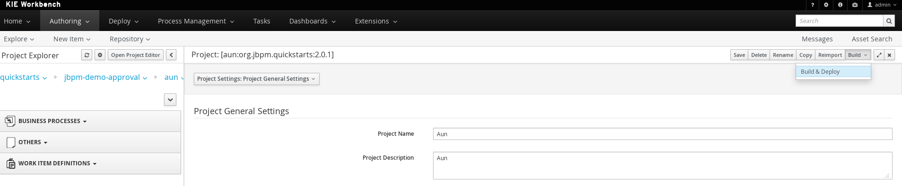

= Build and Deploy BPMN
:toc: manual
:toc-placement: preamble

This page including steps to build and deploy process

== Open Project Editor

`Authoring` -> `Project Authoring`, select the project `aun` under imported repository, click `Open Project Editor`

image:img/jbpm-approval-pre-build.png[Project Editor]

== Build and Deploy

Once `Open Project Editor` be clicked, there will be a Editor Panel, on the right top the panel, click `Build & Deploy`

Once a build success message pop up, the build finished.

== To view deployments

`Deploy` -> `Process Deployments`

image:img/jbpm-approval-process-deployments.png[Process Deployments]

== To view Process Definitions

`Process Management` -> `Process Definitions`.
