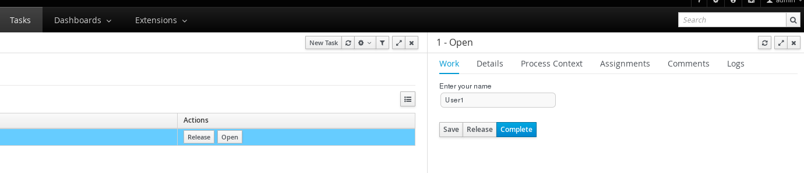
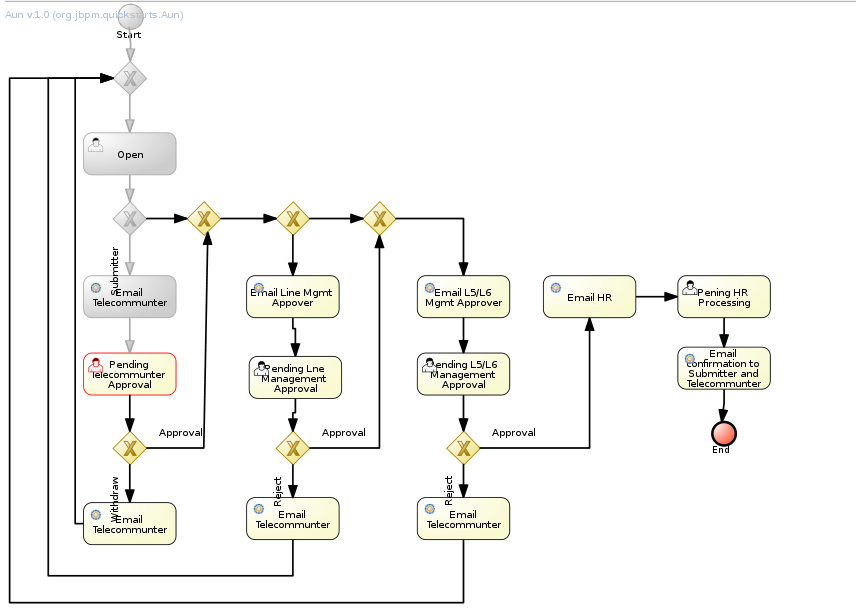

= Telecommunter Open

* Click `Task`, in task active table, click `release`.

* Once `Task` be release, the status will go into `claim`, click the `cliam` to go into `complete` panel

* In `complete` enter `User1` and click `complete`

* Once completed, go into `Process Management` -> `Process Instance`, select the `Aun`, in the right top, click `Ooptions` -> `Process Model`, to view the process status

