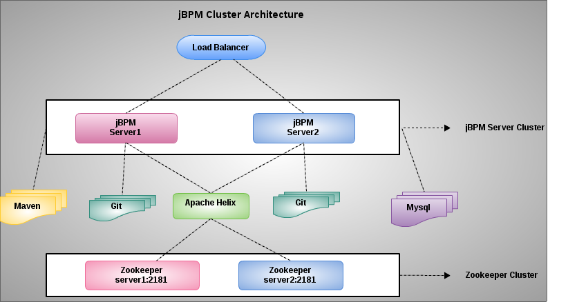

= jBPM Clustered deployment

Primary purpose of this document is to set up a clustered jBPM environment.

== Cluster Architecture

Usually, a BPM system mainly contain 3 components:

1. Design Time Tools - Used to design process, a version control and a process persist tool are necessary, some BPM system use RDBMS to do this, but jBPM use git for version control, maven for persist final process, this also for compatible with recent DevOps, Cloud Solution, git is well demonstrate by Github for version control, maven are great for distributing archive across servers/machines.
2. Runtime Engine - A business process is a abstraction of business logic and involve business people via Human based Task, some time the business logic need roll back or re-orchestrate, that means great number of database interations are necessary. 
3. RDBMS - Some BPM system use store procedure to operated Database, but jBPM use Hibernate with native sql

After the overview of the basic architecture of jBPM, below figure is for how to cluster jBPM.

* Server1 and Server2 are two physical linux server
* Both servers point to a shred Mysql database
* Both servers point to a shred Maven repository
* Both servers point to a shred OpenLDAP server
* Apache Zookeeper and Helix used to replicate assets(process, data modules) between 2 git repositories
* Quartz Job Scheduler used to run complexed timer related process
* Apache httpd with mod_proxy_balancer used as a load balancer

